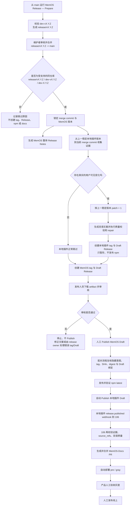
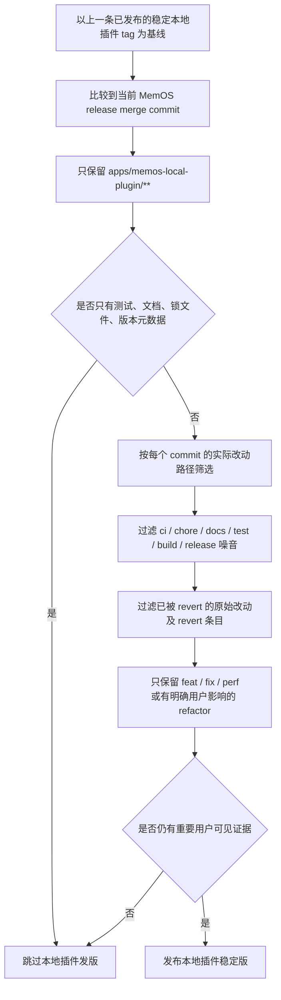
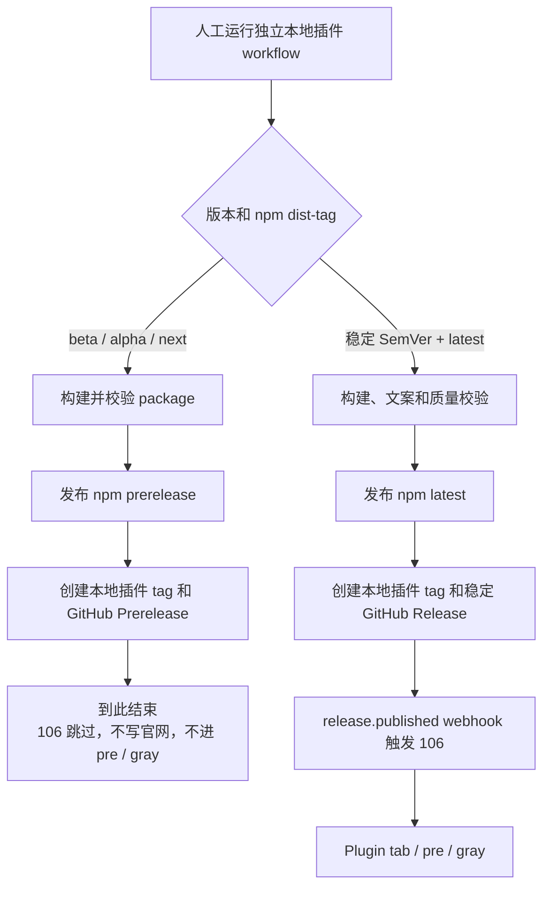
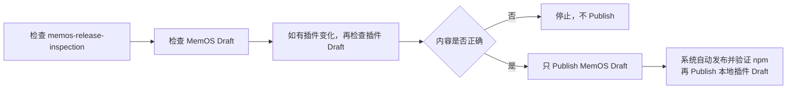

# MemOS Release 与本地插件自动发布链路说明

## 1. 先看结论

这个 PR 与 `MemOS Release — Prepare` 配合后，发布入口分为“准备”和“发布”两段：

```text
发布人员从 main 运行 MemOS Release — Prepare，填写 X.Y.Z
-> 自动校验 dev-vX.Y.Z，并生成只包含主仓版本更新的 release/vX.Y.Z
-> 维护者创建并审核 release/vX.Y.Z -> main PR
-> PR 合并后自动启动 MemOS Release — Publish
-> 自动生成检查结果
-> 创建 MemOS tag 和 Draft Release
-> 如果本地插件确实有用户可见变化，再创建本地插件 tag 和 Draft Release
-> 此时不发布 npm，不写官网，不进入灰度
-> 发布人员只审核并 Publish MemOS Draft
-> 配对流程校验通过后，才发布 npm 和本地插件 Release
-> 本地插件 release.published webhook 触发 106 Doc Agent
-> 自动生成并合并 docs PR，进入 pre / gray
-> 产品人工验收灰度，最后人工发布线上
```

最重要的人工边界是：

1. `release/vX.Y.Z` 合并到 `main` 后，系统会自动创建 tag 和 Draft。
2. 发布人员只手动 Publish `MemOS vX.Y.Z` Draft。
3. 不要手动 Publish 配对的 `MemOS Local Plugin vX.Y.Z` Draft。
4. npm、官网 Plugin tab、pre、gray 都不会在人工 Publish MemOS Draft 前发生。
5. 生产环境仍然必须人工确认和发布。

本次功能 PR 的分支是 `ci/memos-local-plugin-auto-release`。它不符合发版分支命名规则，所以合并这个 PR 本身不会触发 MemOS 发版。

## 2. 这个 PR 具体改了什么

| 改动 | 合并后的效果 |
|---|---|
| 兼容两段式发版入口 | 推荐 `release/vX.Y.Z` 合并到 `main` 后自动生成 tag 和 Draft；历史 `dev-vX.Y.Z` / `dev-X.Y.Z` 直合仍受控兼容 |
| 增加触发分类 | 普通分支、fork、未合并 PR 只记录跳过，不进入发布链路 |
| 增加 `.github/release-notes/vX.Y.Z.md` | 发版分支可为 MemOS 整体 Release 添加简短 Highlights |
| 增加 `release:validate` | 发布前统一检查 Hermes 版本、lint 和测试 |
| 强化本地插件 evidence | 只看插件路径，并按 commit 实际改动、用户影响和 revert 结果筛选 |
| 增加 `auto / skip / manual` | 周发布可自动判断、明确跳过或人工确认下一 patch |
| 自动推导下一稳定 patch | 不需要先提交一个只改 `package.json` 版本的 PR |
| 拆分 stage 与 publish | 合并后先创建插件 tag/Draft，人工 Publish MemOS 后才发 npm |
| 增加 paired Release 契约 | MemOS Release 与插件 Release 的 tag、SHA、digest、URL 必须完全对应 |
| 强化 npm 校验与恢复 | 防止 registry 延迟导致重复发布，并支持已发 npm、未完成 Release 的显式恢复 |
| 强化 artifact 与质量闸门 | 发布前可以检查 Release Notes、证据、双语预览、覆盖率和 repair 结果 |
| 收紧权限与脚本来源 | 默认只读；写权限仅给需要的 job；发布自动化始终使用受信任版本 |

## 3. 合并后完整流程



## 4. 哪些合并会自动触发

自动入口只接受以下全部条件：

| 条件 | 要求 |
|---|---|
| PR 状态 | 已合并，不是只关闭 |
| 目标分支 | `main` |
| PR 来源 | `MemTensor/MemOS` 同仓库分支，不接受 fork |
| 分支名 | 推荐 `release/vX.Y.Z`；兼容 `dev-vX.Y.Z` 或 `dev-X.Y.Z` |
| 版本格式 | 三段稳定 SemVer，例如 `release/v2.0.30`、`dev-v2.1.0`、`dev-3.0.0` |
| 代码版本 | merge commit 中 `pyproject.toml` 与 `src/memos/__init__.py` 的版本必须彼此一致，并与分支版本完全一致 |

以下分支不会触发发布：

```text
feature/xxx
fix/xxx
docs-sync/xxx
dev-v2.0.30-beta.1
dev-v2.0
release/v2.0
```

自动入口固定使用：

```text
target_ref = PR 的 merge commit
local_plugin_release_mode = auto
dry_run = false
create_draft_release = true
```

因此它会创建 tag 和 Draft，但不会越过人工 Publish 边界。

## 5. 本地插件是否发版的严格判定

本地插件不是只要目录里有文件变化就发布。系统会依次做以下判断：



### 5.1 基线不是上一个 MemOS 周版本

本地插件的比较基线是上一条已经发布并完成 npm 校验的稳定本地插件 tag，而不是上一个 MemOS `vX.Y.Z` tag。

这样即使连续几周没有发布本地插件，未发布的有效变化也不会丢失；下一次真正需要发版时会一起被检测到。

### 5.2 没有用户可见变化时

以下情况会被判定为正常跳过，不是 Action 失败：

- `apps/memos-local-plugin/**` 完全没有变化。
- 只有测试、文档、README、锁文件或版本元数据变化。
- 有源码变化，但 commit 只有维护、构建或发布噪音，没有可证明的 feature、fix、performance 影响。
- 一个功能先加入，之后又被 revert，最终版本中不再生效。

正常跳过时：

```text
MemOS tag / Draft Release：仍然创建
本地插件 npm：不发布
本地插件 tag：不创建
本地插件 Release：不创建
Plugin tab / pre / gray：不触发
artifact：记录明确的 skip_reason
```

### 5.3 有用户可见变化时

系统会从上一条稳定本地插件版本自动执行 patch + 1：

```text
上一稳定版：v2.0.13
本次有有效变化
解析版本：v2.0.14
tag：memos-local-plugin-v2.0.14
```

周发布不能借此跳 major 或 minor。需要主动发布 `v2.1.0`、`v3.0.0`、beta、alpha 或 next 时，应使用独立入口 `MemOS Local Plugin (V2) — Legacy Standalone Publisher`。

### 5.4 三种手动模式

手动运行 `MemOS Release — Publish` 时可以选择：

| 模式 | 行为 |
|---|---|
| `auto` | 推荐。自动判断用户可见变化；有变化时自动使用下一 patch。`local_plugin_version` 通常留空。 |
| `skip` | 即使有变化也不发本地插件，并将变化留到下一次继续累计。`local_plugin_version` 必须留空。 |
| `manual` | 明确要求本次发本地插件。必须填写 `local_plugin_version`，但仍必须有用户可见变化，且版本必须是下一 patch。 |

`manual` 不是绕过质量闸门的开关。没有有效变化时仍会失败，不能创建一个只有版本号变化的空发布。

### 5.5 独立本地插件入口仍然保留

`MemOS Local Plugin (V2) — Legacy Standalone Publisher` 仍用于不等待 MemOS 周发布的本地插件发版：



| 使用场景 | 应选入口 |
|---|---|
| 随 MemOS 周版本自动判断是否发布下一 patch | `MemOS Release — Publish` |
| 随时发布 beta、alpha、next | `MemOS Local Plugin (V2) — Legacy Standalone Publisher` |
| 主动发布本地插件 major 或 minor | 独立本地插件入口，并由 release owner 确认版本 |
| 本地插件紧急稳定版，不等待 MemOS 周版本 | 独立本地插件入口的稳定版 + `latest` |

两条稳定版入口共享同一套 npm/tag/Release 完成性校验。某个版本已经由独立入口完整发布后，MemOS 周发布不会重复发布同一版本；它会以上一条已完成的稳定版本为基线，只在之后又积累了新的用户可见变化时推进下一 patch。

## 6. 合并后会生成什么

### 6.1 GitHub 中可见的对象

有本地插件有效变化时，会先创建：

1. MemOS tag，例如 `v2.0.30`。
2. MemOS Draft Release，例如 `Release v2.0.30`。
3. 本地插件 tag，例如 `memos-local-plugin-v2.0.14`。
4. 本地插件 Draft Release，例如 `MemOS Local Plugin v2.0.14`。

此时 npm 尚未发布，本地插件 Draft 也不会产生 `release.published` webhook。

没有本地插件有效变化时，只创建前两项。

### 6.2 检查 artifact

Action 会上传 `memos-release-inspection`，发布人员重点查看：

| 文件 | 用途 |
|---|---|
| `release-notes.md` | MemOS 整体 GitHub Release 页面预览 |
| `local-plugin-evidence.json` / `evidence.json` | 本地插件真实 commit、PR、文件和版本证据，已脱敏 |
| `local-plugin-docs-preview.md` / `docs-preview.md` | 官网 Plugin tab 的中英文可读预览 |
| `local-plugin-docs-preview.json` / `docs-preview.json` | 结构化文案预览 |
| `quality-report.json` | 是否发布、skip 原因、覆盖率、source_refs、repair 次数等 |
| `local-plugin-release-intent.json` | MemOS Release 与配对插件 Release 的预期绑定 |
| `local-plugin-docs-draft.json` | Doc Agent 原始结构化草稿 |

发布人员至少确认：

- `current_tag` 和目标 commit 正确。
- MemOS `What's Changed` 范围正确。
- `local_plugin_release_requested` 是否符合预期。
- 如果发布插件，版本是否为上一稳定版的下一 patch。
- 每条中英文文案是否准确、易懂且没有夸大。
- 每条文案是否有真实 `source_refs`。
- `quality-report.json` 中 `ok=true` 且没有未解释的警告。

## 7. Draft 审核时怎么操作



允许修改 Draft 中面向用户的可见文案，但不要删除或修改 Release body 里的隐藏绑定注释。该注释用于绑定：

- MemOS tag。
- 本地插件 tag 和版本。
- 源码 SHA。
- evidence digest。
- 配对本地插件 Draft URL。

如果隐藏绑定被破坏，后续配对流程会停止，不会发布 npm，也不会发布本地插件 Draft。

如果发现 tag、版本或目标 commit 错误，不要继续 Publish，也不要自行移动已有 tag。由 release owner 审核错误 Draft/tag 后再决定恢复方式。

## 8. 主要防护措施

| 防护层 | 具体措施 | 防止的问题 |
|---|---|---|
| 触发范围 | 只接受同仓库规范发版分支合并到 `main` | 普通 PR、fork PR 或误关闭 PR 触发发版 |
| 可信脚本 | 工作流和发布脚本始终来自受信任的默认分支版本 | 旧 SHA 或待发布源码带回旧发布逻辑 |
| 目标锁定 | 自动入口锁定 PR merge commit | 发布到漂移的 `main` 或错误 SHA |
| 主版本一致性 | 分支版本、Release 版本以及目标提交中的 `pyproject.toml`、`src/memos/__init__.py` 必须一致 | 只改分支名或只改一个版本文件却发布了错误代码版本 |
| 路径隔离 | 只分析 `apps/memos-local-plugin/**` | MemOS 其他模块噪音进入 Plugin tab |
| 文件过滤 | 排除测试、文档、锁文件和版本元数据 | 微小维护变化误发稳定版 |
| 语义过滤 | 只保留有用户影响证据的 feature/fix/performance 等 | chore、merge、release commit 被写成新功能 |
| revert 处理 | 原始改动和对应 revert 一起过滤；之后真正重新实现的 commit 可重新进入 | 已撤销功能仍出现在更新日志 |
| 稳定版版本 | 只能在上一稳定插件版本上 patch + 1 | 版本跳跃、复用旧版本或周发布误升 major/minor |
| 基线完成性 | 上一稳定 tag 必须有已发布 Release、已验证 npm 和正确源码关系 | 使用半成品 tag 作为下一次基线 |
| tag 不可移动 | 已有 tag 指向不同 SHA 时立即失败 | 静默覆盖正式 tag |
| Draft 隔离 | 本地插件始终先暂存为 Draft | MemOS Release 尚未确认时提前触发 106 |
| 配对契约 | MemOS intent 和插件 binding 必须各恰好一个并完全匹配 | 两个 Release 串错版本、源码或证据 |
| 发布顺序 | 先 Publish MemOS，再验证 npm，最后 Publish 插件 Draft | docs 早于 npm 或主版本发布 |
| npm 防重复 | 发布前鉴权；发布后有限等待并校验 tarball integrity 和内容；不盲目二次 publish | npm 延迟导致重复发布或错误包被当作成功 |
| 文案质量 | source_refs 覆盖、双语、条数、长度、重要 commit 覆盖；最多 repair 3 次 | 空中文、英文夹中文、漏 commit、虚构或过长文案 |
| 最小权限 | 默认只读，只有创建 tag/Release 的 job 临时使用写权限 | 工作流拥有不必要的仓库写权限 |
| 并发锁 | 同一发布链串行，`cancel-in-progress=false` | 两个发布同时争抢 tag、npm 或 Release |
| 敏感信息 | token、106 地址等只从 Secrets 读取；artifact 使用脱敏证据 | 凭据进入代码、日志、Release 或 artifact |
| 生产边界 | pre/gray 后仍需人工验收并发布线上 | 自动化直接影响生产环境 |

## 9. 出错时会发生什么

整个链路采用 fail closed：校验不确定时停止，而不是猜测后继续发布。

| 出错位置 | 自动行为 | 已产生的影响 | 正确处理 |
|---|---|---|---|
| 分支名不符合规则 | 后续 job 跳过 | 无 tag、Release、npm、docs | 如果确实要发版，使用规范 release 分支或手动入口 |
| 分支版本与两个主版本文件不一致 | prepare 阶段失败 | 不创建 tag、Draft、npm 或 docs | 通过 `MemOS Release — Prepare` 重新生成一致的 release 分支，不能只修改分支名或单个版本文件 |
| 版本、目标 SHA 或 tag 冲突 | prepare 或创建 Release 阶段失败 | npm 和 docs 不会发布 | 核对目标 commit；不要移动正式 tag，由 release owner 处理 |
| 没有用户可见插件变化 | 正常跳过插件发布 | 只继续创建 MemOS Draft | 查看 `skip_reason`，无需修复 |
| Doc Agent 草稿质量不合格 | 最多 repair 3 次，仍不合格则失败 | 不创建 tag/Draft/npm/docs | 查看 `quality-report.json` 和 evidence，修复证据或文案规则后重跑 |
| 本地插件暂存失败 | MemOS Release job 不继续 | 不创建 MemOS Draft，npm 不发布 | 修复构建、包审计或证据问题后重跑；如果 tag/Draft 已创建，系统只会在同一 MemOS 版本、同一源码和完整隐藏绑定全部匹配时复用 |
| Draft 审核发现错误 | 等待人工，不会自动 Publish | tag 和 Draft 已存在，但 npm/docs 未发生 | 不要 Publish；由 release owner 处理错误 Draft/tag |
| 隐藏 intent/binding 被改坏 | 配对校验失败 | MemOS 可能已发布，但 npm、插件 Release、docs 被拦截 | 恢复正确绑定后使用配对恢复入口，不能手工绕过 |
| npm 返回不确定或可见性延迟 | 有限轮询和内容校验，不盲目重发 | 插件 Draft 保持 Draft，docs 不触发 | 先确认 registry 中的实际版本；再走显式 recovery |
| npm 已成功但插件 Draft 发布失败 | 流程停止 | npm 已有版本，插件 Draft 未发布，docs 未触发 | 配对恢复会先验证现有 npm 内容，再发布 Draft，不会二次 npm publish |
| 本地插件 Draft 被人提前 Publish | 契约或 106 校验应拒绝继续 | 可能产生失败通知，不应写 docs | 立即停止，由 release owner 核对 Release 状态和恢复方案 |
| 106 webhook 或队列失败 | 106 停止写 docs并保留失败信息 | npm/Release 已发布，docs/pre/gray 未继续 | 修复 106 后再重放 webhook，不手工绕过 source_refs 和双语校验 |
| docs PR 或 pre/gray 失败 | 后续部署停止 | 不进入生产 | 修复 PR 或部署问题；灰度通过后仍由人发布线上 |

### 9.1 配对发布恢复入口

只有在 MemOS Release 已发布、但 npm 或配对本地插件 Release 因部分失败未完成时，才使用：

```text
Workflow: MemOS Release — Publish Paired Local Plugin
memos_release_tag: vX.Y.Z
recovery_confirmation: PUBLISH PAIRED LOCAL PLUGIN FOR vX.Y.Z
```

这个入口会重新校验绑定和现有 npm 包，不是强行跳过校验。正常发布不要手动运行它。

## 10. 手动入口怎么用

建议先做无副作用预览：

| 字段 | 建议填写 |
|---|---|
| Use workflow from | `main` |
| `version` | MemOS 版本，不带 `v`，例如 `2.0.30` |
| `target_ref` | `main` |
| `local_plugin_release_mode` | `auto` |
| `local_plugin_version` | 留空 |
| `dry_run` | `true` |
| `create_draft_release` | `true` |
| `publish_confirmation` | 留空 |
| `recover_existing_local_plugin_publish` | `false` |

确认 artifact 后，再运行 Draft 模式：

```text
dry_run = false
create_draft_release = true
publish_confirmation = PUBLISH v2.0.30
```

如果在 `auto` 模式填写了本地插件版本 guard，例如 `2.0.14`，确认词必须是：

```text
PUBLISH v2.0.30 WITH LOCAL PLUGIN v2.0.14
```

不要用手动入口重复运行已经由发版分支合并自动创建的同一版本。先查看原 Action run、tag 和 Draft 状态，部分失败时走专门 recovery。

## 11. `.github/release-notes` 的作用

发版分支可以选择增加：

```text
.github/release-notes/vX.Y.Z.md
```

例如：

```text
.github/release-notes/v2.0.30.md
```

它只用于给 MemOS 整体 GitHub Release 增加简短的产品重点，并放在 GitHub 自动生成的 `What's Changed` 前面。

它不能：

- 决定是否发布本地插件。
- 替代 `apps/memos-local-plugin/**` 的 git evidence。
- 手工指定 Plugin tab 条目。
- 存放 Doc Agent 隐藏 payload、token、106 地址或其他敏感信息。

本地插件版本和 Hermes manifest 的同步由发布脚本在受控的发布元数据步骤中完成，不要求开发人员为了周发布提前提交一个只改版本号的 PR。

## 12. 这个 PR 不会自动完成什么

这个 PR 负责 MemOS 仓库内的工作流、校验、tag/Release 配对和 npm 发布顺序。它不会单独完成以下外部操作：

- 不会部署或重启 106 Doc Agent。
- 不会修复历史上已经错误发布的 tag、Release 或 docs 条目。
- 不会替发布人员审核 Draft。
- 不会自动发布生产环境。
- 不会替代 GitHub Secrets、npm 权限、webhook 和 106 持久化队列的部署验收。

正式启用前应确认：

1. `NPM_TOKEN`、Doc Agent draft URL/token 等 Secrets 已配置且有效。
2. 106 已部署支持本地插件 binding/intent 契约的版本。
3. GitHub `release.published` webhook 可到达 106，持久化队列 timer 处于 active。
4. MemOS-Docs 自动 PR、pre、gray 仍可用，生产发布保持人工。
5. 本 PR 的脚本测试、workflow 语法检查和本地插件测试全部通过。

## 13. 发布人员最短操作清单

```text
1. 从 main 运行 MemOS Release — Prepare，填写本次稳定版本 X.Y.Z。
2. 按 Action 给出的链接创建并审核 release/vX.Y.Z -> main PR。
3. 合并 PR，等待 MemOS Release — Publish 自动完成。
4. 下载 memos-release-inspection，检查 Release Notes、evidence、docs preview、quality report。
5. 检查 MemOS Draft；如果有插件版本，再检查本地插件 Draft。
6. 有问题就停止，不要 Publish，也不要移动 tag。
7. 没问题时只 Publish MemOS Draft。
8. 检查 MemOS Release — Publish Paired Local Plugin：npm 和插件 Release 均成功。
9. 检查 106 通知、MemOS-Docs PR 和 pre / gray。
10. 产品验收灰度后，人工发布线上。
```
